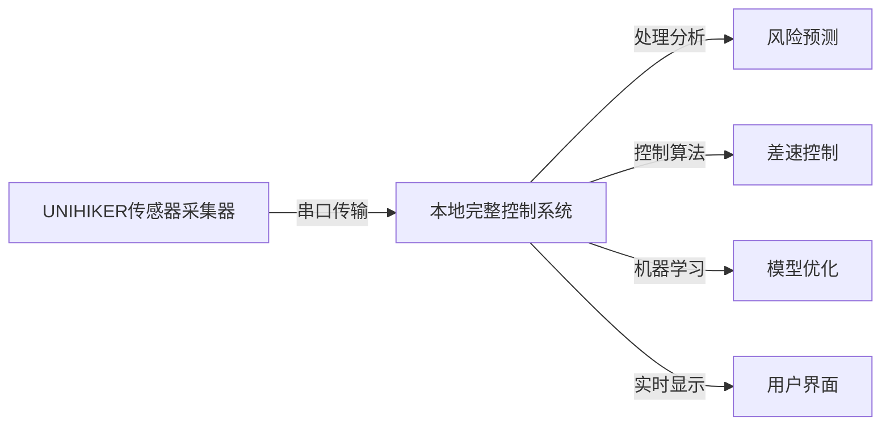

# Troll-vs-Troll

## Version Log
- v1.0.0 2025-12-28: Initial version - Success
- v1.0.1 2025-12-18至2026-01: 差速处理内核开发 - 测试未通过（M10 API不熟悉）
- v1.1.0 2025-12-28: Added UNIHIKER M10 hardware foundation information - Success
- v1.2.0 2026-02-17: 完成本地开发环境和Web界面 - Success
- v1.3.0 2026-02-17: 新增机器学习增强功能 - 测试中
- v1.3.1 2026-02-17: 系统架构重大升级 - 待测试
- v1.4.0 2026-02-21: **全新架构设计 - M10单文件限制优化，本地承担全部处理功能** - 开发中

## Project Version: 1.4.0 - 单文件架构优化版 (开发中)

*For SES student project*: Trolley-Anti-Troll is an electronic differential system for pull-handle carriers (e.g., suitcases) to prevent rollover. It replaces mechanical structures with lightweight electronic control, using real-time wheel slip monitoring to enhance stability during turns. Low-cost, energy-efficient, and easy to deploy.

This project will be developed around and based on the UNIHIKER M10 Model flight control board as the hardware foundation.

**重要说明**: 本项目自2025年12月28日起文档未更新，请注意时效性。

**项目时效性提醒**: 如您在README及其他自述性文件中看到此提醒，请注意这些文档可能已过时。项目实际进展情况请参考Update_Log.md文件。

**🚨 行空板开发重要提示**: 所有涉及UNIHIKER M10行空板的代码开发都**必须严格参照/ref目录下的官方文档**，包括但不限于：
- [行空板官方文档-unihiker库](./ref/UNIHIKER-M10-Documentation/行空板官方文档-unihiker库.html) - 屏幕显示和GUI控制
- [行空板官方文档 - pinpong库](./ref/UNIHIKER-M10-Documentation/行空板官方文档 - pinpong库.html) - 硬件接口和传感器控制

严禁在未查阅官方文档的情况下进行行空板相关开发！

**✨ 最新功能**: 智能闭环控制系统
- 实现完整的反馈控制循环：传感器输入→数据分析→控制执行→效果评估→机器学习优化
- 集成强化学习代理进行策略优化
- 所有数据传输频率参数统一配置化管理
- 新增API端点支持实时性能监控和模型训练
- 统一配置管理系统，所有参数集中管理
- API驱动的动态参数加载和更新
- 一体化用户界面，整合运动控制与传感器输入
- 实时数据流统一，支持差速控制、机器学习、物理仿真协同工作
- 去中心化参数设计，提高系统可维护性和扩展性

**⚠️ 重要技术警告**: 差速控制内核存在严重设计缺陷：
1. 会阻止所有正常转向操作
2. 错误的姿态角计算方法导致日常使用中频繁误判

详情请查看Update_Log.md中的问题记录。

项目当前状态：智能闭环控制系统开发完成，正在进行集成测试验证。

## Project Features and Usage

Trolley-Anti-Troll is designed to prevent rollover in pull-handle carriers (e.g., suitcases) by implementing an electronic differential system. The system monitors wheel slip in real-time and adjusts wheel speeds during turns to maintain stability.

For detailed version history and updates, please see [Update_Log.md](file:///E:/Comp/特需/Troll-vs-Troll-main/Troll-vs-Troll-main/Update_Log.md).

## 🚀 全新单文件架构设计 (版本 1.4.0)

基于UNIHIKER M10只能上传一个文件的重要限制，我们重新设计了系统架构：

### 核心理念
**M10只负责一件事：传感器数据采集和传输**
**本地计算机承担所有复杂处理任务**

### 新架构优势
- ✅ **符合硬件限制**：严格遵守UNIHIKER单文件上传约束
- ✅ **资源优化**：M10专注轻量级数据采集，本地计算机处理复杂算法
- ✅ **功能完整**：所有原有功能在本地得到完整保留和增强
- ✅ **易于维护**：清晰的职责分离，便于调试和升级

### 部署文件
- [`unihiker_sensor_collector.py`](file:///E:/Comp/特需/Troll-vs-Troll-main/Troll-vs-Troll-main/unihiker_sensor_collector.py) - UNIHIKER端单一文件（纯数据采集）
- [`local_complete_system.py`](file:///E:/Comp/特需/Troll-vs-Troll-main/Troll-vs-Troll-main/local_complete_system.py) - 本地完整控制系统
- [`UNIHIKER_New_Architecture_Guide.md`](file:///E:/Comp/特需/Troll-vs-Troll-main/Troll-vs-Troll-main/UNIHIKER_New_Architecture_Guide.md) - 新架构部署指南

### 系统架构


### 功能分布

**UNIHIKER端（极简设计）：**
- 实时传感器数据读取（加速度、陀螺仪、光线等）
- 简单的状态显示
- 高效的数据打包和串口传输
- 最小化的资源占用和功耗

**本地端（完整功能）：**
- 复杂的数据处理和特征提取
- 机器学习模型训练和预测
- 差速控制算法计算
- 实时可视化界面
- 数据存储和分析
- 系统配置和调优

## New Feature: UNIHIKER M10 Benchmark Demo

The project now includes a comprehensive benchmark demo ([benchmark.py](file:///E:/Comp/特需/Troll-vs-Troll-main/Troll-vs-Troll-main/src/main/benchmark.py)) that tests all onboard sensors, display components, and computational performance of the UNIHIKER M10 board. The demo features a page-based UI to navigate through different sensor readings and performance metrics.

## Machine Learning Component

The project now includes a machine learning module for predicting rollover risk based on sensor data. The [rollover_prediction.py](file:///E:/Comp/特需/Troll-vs-Troll-main/Troll-vs-Troll-main/src/ml/rollover_prediction.py) module implements algorithms to predict when the pull-handle carrier is at risk of rollover using accelerometer and gyroscope data.

## Sensor Data Processing

The [data_processor.py](file:///E:/Comp/特需/Troll-vs-Troll-main/Troll-vs-Troll-main/src/sensors/data_processor.py) module processes raw sensor data to extract meaningful features for the machine learning model. It includes filtering, feature extraction, and anomaly detection capabilities.

## Differential Control System

The [differential_controller.py](file:///E:/Comp/特需/Troll-vs-Troll-main/Troll-vs-Troll-main/src/control/differential_controller.py) module implements the electronic differential control algorithm. It adjusts wheel speeds based on the machine learning model's rollover risk predictions to prevent side tipping during turns and sudden movements.

## Sensor Data Generation

The [data_generator.py](file:///E:/Comp/特需/Troll-vs-Troll-main/Troll-vs-Troll-main/src/utils/data_generator.py) module generates realistic sensor data for training and testing the machine learning models. The data simulates real-world scenarios for pull-handle carriers including normal movement, turns, and rollover risks.

## 系统架构与数据流

```mermaid
graph TD
    A[用户交互层] --> B[Web API接口层]
    B --> C[核心处理层]
    C --> D[数据存储层]
    D --> E[机器学习层]
    
    subgraph "用户交互层"
        A1[3D立方体界面] --> A
        A2[滑块控制面板] --> A
        A3[物理参数设置] --> A
        A4[学习模式界面] --> A
    end
    
    subgraph "Web API接口层"
        B1[/api/send_sensor_data] --> B
        B2[/api/get_config] --> B
        B3[/api/update_config] --> B
        B4[/api/save_training_data] --> B
        B5[/api/get_latest_results] --> B
    end
    
    subgraph "核心处理层"
        C1[传感器数据处理器] --> C
        C2[侧翻风险预测器] --> C
        C3[差速控制器] --> C
        C4[反馈控制器] --> C
        C5[强化学习代理] --> C
    end
    
    subgraph "数据存储层"
        D1[system_config.json] --> D
        D2[current_sensor_data] --> D
        D3[training_data.json] --> D
        D4[recent_results缓存] --> D
    end
    
    subgraph "机器学习层"
        E1[离线训练器] --> E
        E2[特征工程模块] --> E
        E3[模型持久化] --> E
    end
    
    %% 数据流向
    A -->|用户操作数据| B1
    B1 -->|传感器数据| C1
    C1 -->|处理后特征| C2
    C2 -->|风险评估| C3
    C3 -->|控制指令| C4
    C4 -->|学习样本| E1
    C4 -->|性能报告| D4
    B3 -->|配置更新| D1
    B4 -->|训练数据| D3
    E1 -->|训练模型| D3
```

## 详细数据流说明

### 主要数据处理流程：
1. **用户输入** → 3D界面交互产生传感器模拟数据
2. **API传输** → 通过`/api/send_sensor_data`发送到后端
3. **核心处理** → 传感器处理器→风险预测→差速控制→反馈优化
4. **结果输出** → 实时显示处理结果和控制状态
5. **学习循环** → 记录控制效果用于模型优化

### 数据共享机制：
- **统一配置**：所有组件共享`system_config.json`
- **实时数据**：全局`current_sensor_data`变量
- **结果缓存**：`recent_results`存储最近50次处理结果
- **训练数据**：学习模式收集的数据供离线训练使用

## 项目进展历史

### 前期开发 (2025/12/18 - 2026年1月)
- 开发了main.py主程序及相关差速处理内核
- **测试结果：未通过**
- **失败原因**：未完全了解M10硬件的API，ref中的文档可能不够完备
- 差速处理内核仍在测试中

### 当前阶段 (2026/2/17)
完成了如您所见的其余内容：
- 本地（脱离M10硬件）的完整测试模板
- 相应的控制服务器(web_server.py)
- 静态内容和Web界面
- 3D传感器数据模拟器
- 本地演示系统

## Important Notice

If you are a developer or an AI tool assisting in writing project code, you **must** thoroughly read and strictly follow all guidelines in [Developer_Guidelines.md](file:///E:/Comp/特需/Troll-vs-Troll-main/Troll-vs-Troll-main/Developer_Guidelines.md). If changes are made that violate these guidelines, it would be better not to make them at all, and such changes should be reverted.